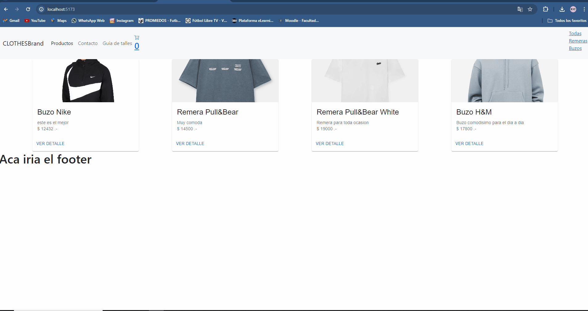

# Proyecto Final E-Commerce React JS - Facundo Minetto

### Este es un E-Commerce hecho en el curso de React JS en Coderhouse por Facundo Minetto

#### Las herramientas utilizadas son:

- React
- MUI
- BootStrap
- HTML
- JavaScript
- CSS
- FireBase

### Para ir directamente a la pagina podes a traves de este [link](blablabla.com)

#### Ejemplo de navegacion en la pagina:

